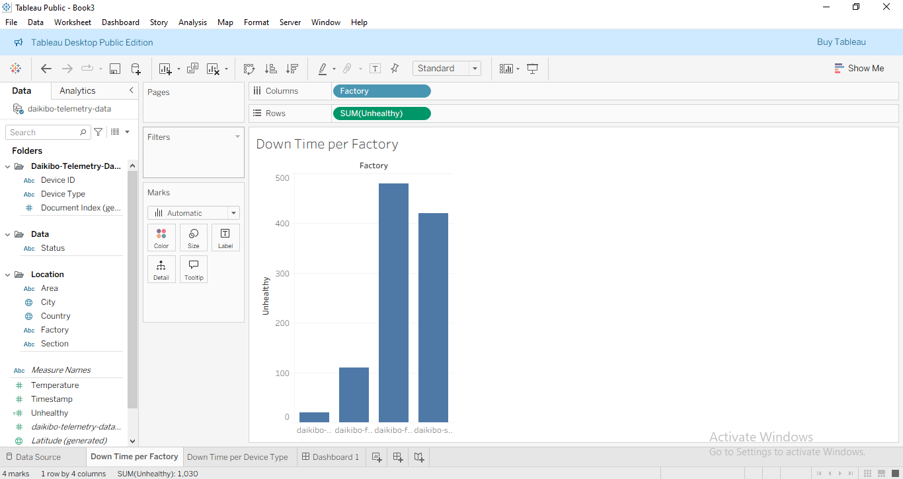
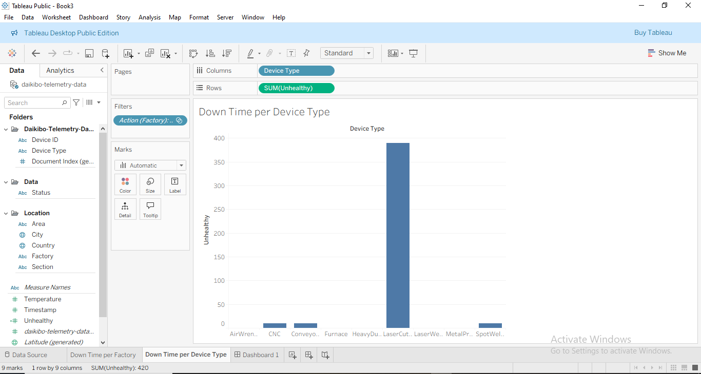

# 🏭 Factory Telemetry Downtime Analysis — Deloitte Job Simulation

**Objective:** Analyze telemetry data from Daikibo’s four factories to determine:  
1. Which factory had the most machine breakdowns  
2. Which machine types were most responsible for downtime  

---

## 🛠 Tools & Skills
- **Tool:** Tableau  
- **Skills:** JSON data connection, downtime analysis, dashboard design, data storytelling  

---

## 📊 What I Built
- Connected and unified telemetry data from a large JSON file (160+ rows).  
- Built visualizations comparing **downtime per factory** and **downtime per device type**.  
- Designed an **interactive Tableau dashboard** to help stakeholders quickly identify breakdown patterns.  

---

## 📈 Key Insights
- One factory recorded **significantly higher machine downtime** than the others.  
- A specific **machine type was disproportionately responsible** for failures in that factory.  
- Insights highlight opportunities for **preventive maintenance** and better **resource allocation**.  

---

## 📸 Visualizations

**Downtime by Factory**  

**Downtime by Machine Type**  

**Dashboard Overview**  

---

## 📂 Files
- `/tableau/factory_downtime.twbx` — Tableau workbook  
- `/assets/` — screenshots of dashboard and charts  
- `/data/telemetry_sample.json` — sample dataset (if sharable)  

---

## 🔎 How to View
1. View the static screenshots above for quick insights.  
2. Open the interactive dashboard via Tableau Public (https://public.tableau.com/views/Book3_17527554662180/DownTimeperDeviceType?:language=en-GB&:sid=&:display_count=n&:origin=viz_share_link).  
3. Or download `.twbx` and open in Tableau Desktop/Public.  

---

## 📜 License
MIT © Oluwaotosin Olaniyan
